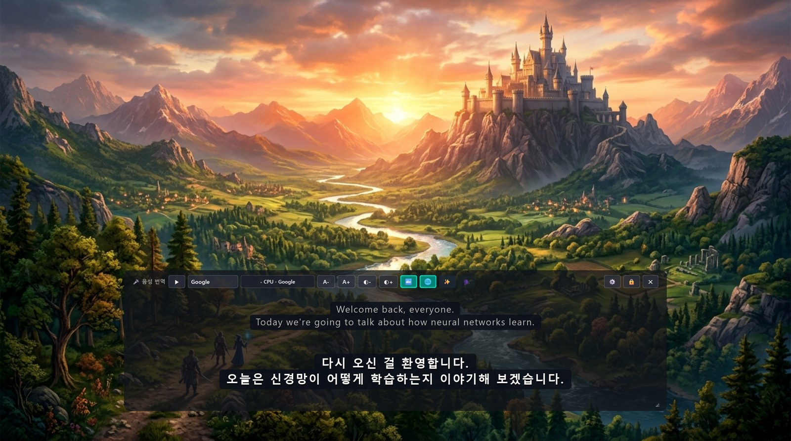
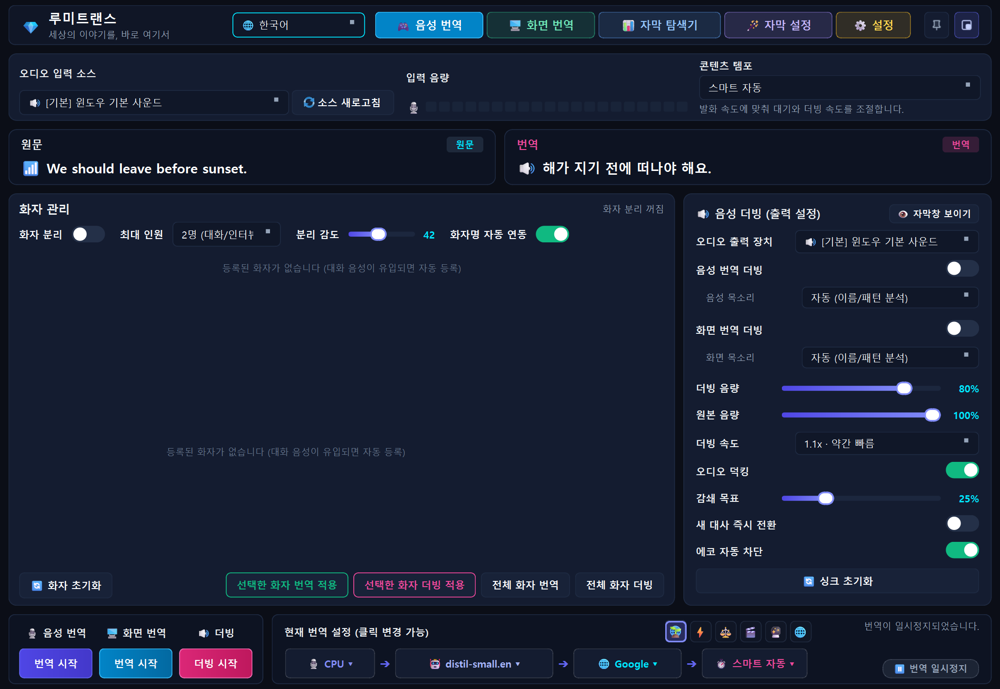
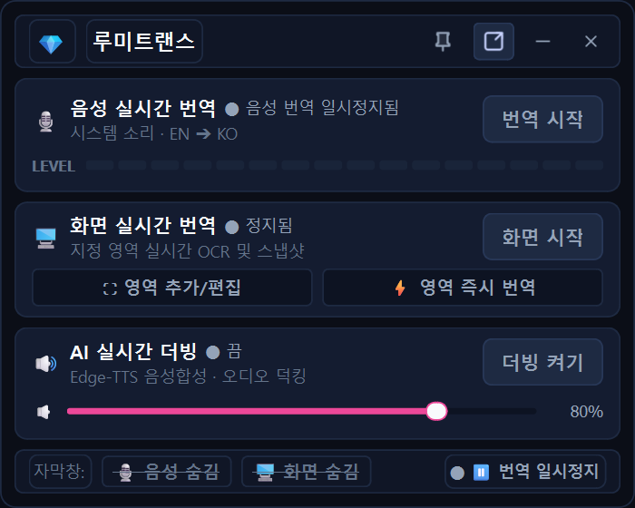
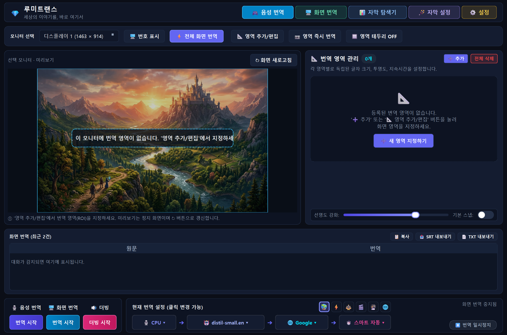
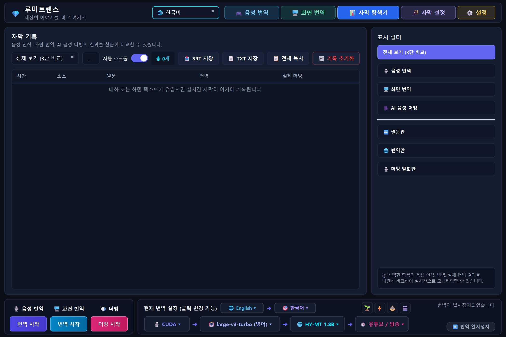
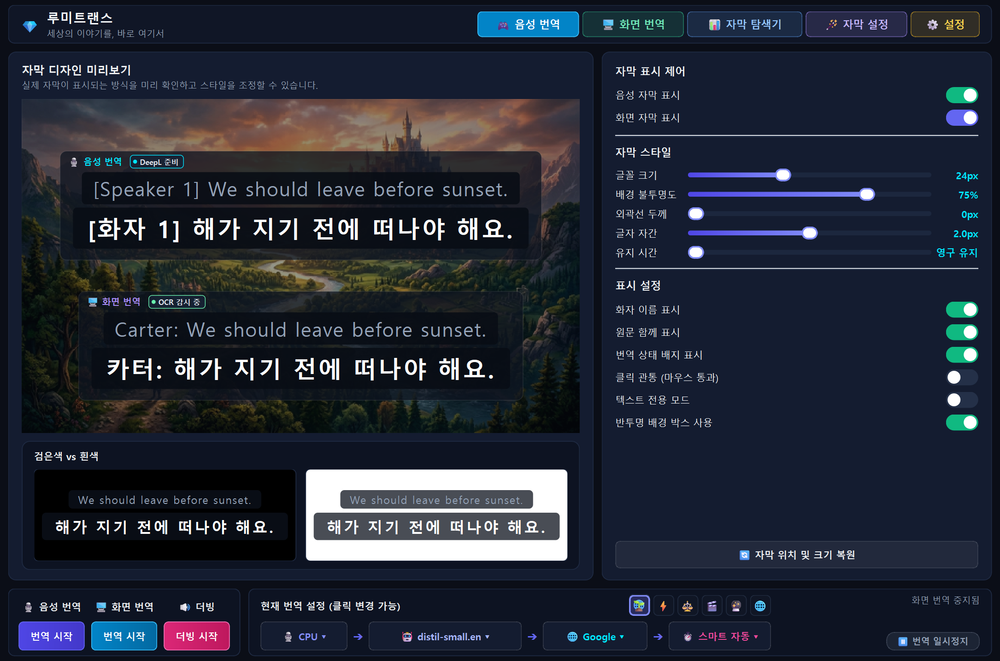
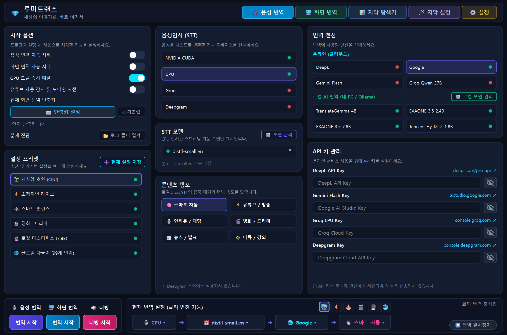

# 🎤 LumiTrans

[한국어](README.ko.md) | **English**

**AI Real-Time Audio & Screen Subtitle Translator and Dubbing for Windows**

LumiTrans is an all-in-one standalone desktop application that **listens to PC audio (YouTube, Netflix, games, lectures, meetings) and captures on-screen text in real time, translating them into multilingual subtitles and natural AI dubbing (TTS)** displayed in an always-on-top overlay.



---

## 🌟 Key Features (v1.1.1)

### 1. 🗗 Mini Mode (Compact PiP Controller) [NEW!]
- **Shortcut `Ctrl+M`**: Instant toggle between Full Settings Panel and Ultra-compact Mini Mode.
- **Minimalist Control**: Compact card view designed for gaming, video streaming, and video calls without blocking screen contents. Directly control Real-Time Audio translation, Screen translation, AI Dubbing & volume, and subtitle overlay visibility with one click.
- **📌 Always on Top (Pin) & Clamped Moving**: Pin the mini controller on top of active games or videos; includes screen top boundary clamping to prevent window overflow.
- **100% Windows Native Frame**: Native OS titlebar restored in Full Mode for full compatibility with Windows Aero Snap and Windows 11 Snap Layouts with immersive dark mode.
- **High-DPI Sharp Vector Icons**: Razor-sharp vector rendering optimized across 100%, 125%, 150%, and 4K displays.
- **Persistent Session State**: Remembers your active mode upon app exit and launches straight into Mini Mode if closed in Mini Mode.

### 2. 🌐 Full Global Multilingual & i18n Support [NEW!]
- **15 Supported Languages**: Comprehensive UI and subtitle translation for English, Korean, Japanese, Chinese (Simplified & Traditional), Spanish, French, German, Russian, Portuguese, Italian, Vietnamese, Thai, Indonesian, and Hindi.
- **Automatic Language Detection**: Automatically recognizes your system locale on first startup, with one-click language switching in Settings.
- **Multilingual Speech & Screen Recognition**: Seamlessly transcribe and translate voices and text from across the globe into your preferred target language.

### 3. 🔊 Real-Time AI Dubbing (Edge-TTS) [NEW!]
- **Natural Neural Voices**: Reads translated subtitles aloud in real time using high-fidelity neural speech synthesis.
- **Independent Dual Control**: Toggle and configure dubbing for audio translation and screen translation independently.
- **Fine-Tuning**: Adjust speech speed, volume, and choose optimal voice profiles per language.

### 4. 🎯 In-Place Screen Capture & Instant Translation (OCR) [NEW!]
- **Global Hotkeys**:
  - `F4`: Instant in-place translation for selected ROI or active game/app window.
  - `F9`: Instant full-screen capture and translation.
- **Intuitive Control Panel**: Lightning (instant translate), Camera (full screen), Close (X), and helpful mouse-hover tooltips.
- **Smart Speaker Preservation**: Automatically distinguishes speaker headers (e.g., `Nora Treadwell:`, `Detective:`) in game dialogues without scrambling names or punctuation.

### 5. 🧠 Multi-Engine Translation Hub
- **Google Translate**: Default built-in online route; no API key needed.
- **DeepL / Gemini / Groq**: Register your personal API keys for top-tier quality (Groq offers ultra-low-latency LPU cloud translation).
- **Local Offline Translation**: Full integration with EXAONE 3.5 (2.4B/7.8B), TranslateGemma, and Ollama local LLMs.
- **Smart Fallback**: Automatic recovery through fallback providers (Google -> MyMemory) if primary engines fail.

### 6. ⚡ Triple Hardware Acceleration
- **NVIDIA GPU (CUDA)**: Ultra-fast local inference powered by TensorRT and CTranslate2.
- **CPU Multithreading**: Optimized for smooth performance even on systems without a dedicated GPU.
- **Groq Cloud STT**: Offload speech recognition to high-speed cloud infrastructure for zero latency on lightweight PCs.

### 7. 🎬 Netflix-Style Smart Subtitle Overlay
- **Click-Through Mode**: Interact freely with underlying games, YouTube controls, or browser windows through the transparent overlay.
- **Dynamic Auto-Fit**: Intelligently calculates font size and height based on sentence length.
- Drag-and-drop repositioning, real-time opacity adjustment, and live typing previews.

---

## 📸 Screenshots

### 🗗 New in v1.1.1: Ultra-Compact Mini Mode (PiP UI)
Unobtrusive compact control designed to stay on top of games, videos, and calls without blocking content. One-click access to voice/screen translation, AI dubbing volume, and pin controls (`Ctrl+M`).

| Full Mode (Settings & Native Frame) | Ultra-Compact Mini Mode (PiP Controller) |
|:---:|:---:|
|  |  |

<details>
<summary>More: Tabs &amp; Overlay Screenshots</summary>

| Screen Translation (OCR) | Subtitle Explorer |
|:---:|:---:|
|  |  |

| Subtitle Style | Settings Tab |
|:---:|:---:|
|  |  |

| Screen Translation Overlay |
|:---:|
|  |

</details>

---

## 📥 Download (Windows Installers)

Prebuilt Windows installers are available on the [GitHub Releases](https://github.com/makopss/LumiTrans/releases) page:

| Edition | File Name | Size | Recommendation & Features |
|---|---|---|---|
| **Korean Lite** | `LumiTrans_Lite_Setup_v1.1.1.exe` | ~194 MB | Korean-optimized lightweight installer (models download on first run) |
| **Korean Full** | `LumiTrans_Full_Setup_v1.1.1.exe` | ~790 MB | Includes Korean offline STT model & CUDA 12 acceleration libraries |
| **Global Lite** | `LumiTrans_Global_Lite_Setup_v1.1.1.exe` | ~194 MB | 15-language global edition (models download on first run) |
| **Global Full** | `LumiTrans_Global_Full_Setup_v1.1.1.exe` | ~923 MB | 15-language global edition + multilingual STT models + CUDA 12 bundled |

---

## 🚀 Running from Source

Tested on Windows with Python 3.12.

```powershell
# Create and activate virtual environment
python -m venv .venv
.\.venv\Scripts\Activate.ps1

# Install dependencies
pip install -r requirements.txt

# Run application
python run.py
```

### Quick Launch via Batch
Double-click **`run.bat`** in the project root to start immediately.

### Building Windows Installers (Setup.exe)
```powershell
# Build Korean editions (Lite + Full)
python scripts/build_windows_installer.py --product kr --edition all

# Build Global editions (Lite + Full)
python scripts/build_windows_installer.py --product global --edition all
```
Generated installers will be located in the **`installer_output/`** directory.

---

## 🔑 API Keys (Optional)

Basic online translation works out-of-the-box without API keys. You can register your own keys for enhanced quality:
- **Control Panel → Settings → `[🔑 Register & Manage Free API Keys]`**
  - **DeepL API Key**: [DeepL API](https://www.deepl.com/pro-api) (500k free chars/month)
  - **Gemini API Key**: [Google AI Studio](https://aistudio.google.com) (Generous free tier)
  - **Groq API Key**: [Groq Console](https://console.groq.com) (Ultra-fast cloud LPU tier)

Keys are stored locally and encrypted within your private `config.json`.

---

## 🩺 Troubleshooting & Diagnostics

- Installed versions run in background desktop mode; logs are saved in `%APPDATA%\LumiTrans` (`stdout.log`, `stderr.log`, `crash.log`).
- Open the log directory directly via **Settings → Troubleshooting → 📂 Open Log Folder**.
- To run with live console output, launch via **Start Menu → LumiTrans (Debug Mode)** or execute `LumiTrans.exe --console`.

---

## 📜 License

Distributed under the [GNU General Public License v3.0](LICENSE).

```
Copyright (C) 2026 makopss

This program is free software: you can redistribute it and/or modify
it under the terms of the GNU General Public License as published by
the Free Software Foundation, version 3 of the License.
```
